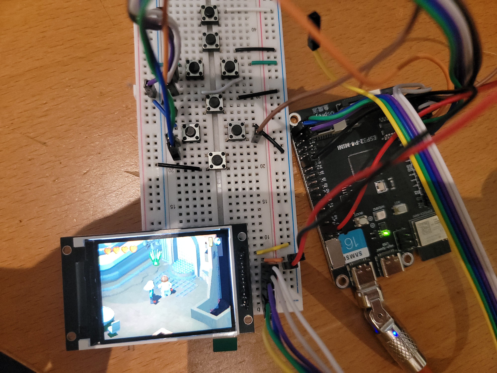

# PLEASE READ !
This is a very early "port" the retro-go codebase was butchered to make it compatible with the ESP32-P4 and the lastest ESP-IDF.

This "port" include the GBA emulator wich runs way better than on the original ESP32(S3). 
Few games achieve full speed with frameskip at 5 but 50% of them will run at 70% speed on average.
The more graphicaly intense games like sega rally will really struggle and achieve about 40% speed on average.

## How to flash:
rg_tool.py produce a weird .img when packing the apps with the bootloader so we will build (and flash) the bootloader separately as a workaround.
This is specific to the ESP32-P4 and might be easy to fix but I haven't dug any further.
- first open up the hello world example from ESP-IDF. We are going to use it to flash the basic bootloader
- set the target to ESP32-P4 `idf.py set-target esp32p4`
- build, flash and monitor `idf.py build flash monitor`
- Now you will see some comments on your chip, check your chip revision ex `I (27) boot: chip revision: v1.0`
- if you have v1.0 you will need a very recent version of ESP-IDF (I used V5.5-rc1)
- if you have v0.1 and can compile the example, you can probably stick to your current version but I would recommand upgrading ESP-IDF if you have problems
- now go back to retro-go, compile all apps with this command `python rg_tool.py --target esp32-p4 build-img all --no-networking`
- next locate the `partition.csv` file, it should be in the retro-go root's folder
- copy and paste it in the hello_world example folder
- do the same with the sdkconfig file inside the launcher folder of retro-go
- now build, flash and monitor the hello_world example (again) `idf.py build flash monitor`
- if everything goes well you will have sucessfully flashed the bootloader
- now you will have to install the apps separately, run `esptool.py --chip esp32p4 write_flash --flash_size detect 0x10000 launcher/build/launcher.bin` to install the launcher
- for the other apps, I would recommend you to check the right offset in the partition.csv (don't forget to convert it to Hex)
    retro-core for example : `esptool.py --chip esp32p4 write_flash --flash_size detect 0x100000 retro-core/build/retro-core.bin`
    and here are my personal commands :
<pre>
esptool.py --chip esp32p4 write_flash --flash_size detect 0x10000 launcher/build/launcher.bin
esptool.py --chip esp32p4 write_flash --flash_size detect 0x100000 retro-core/build/retro-core.bin
esptool.py --chip esp32p4 write_flash --flash_size detect 0x210000 prboom-go/build/prboom-go.bin
esptool.py --chip esp32p4 write_flash --flash_size detect 0x2F0000 gwenesis/build/gwenesis.bin
esptool.py --chip esp32p4 write_flash --flash_size detect 0x400000 fmsx/build/fmsx.bin
esptool.py --chip esp32p4 write_flash --flash_size detect 0x4B0000 gbsp/build/gbsp.bin
</pre>

Congratulations! You successfully installed retro-go on an ESP32-P4
note: If you want to make changes to a specific app, you don't have to flash them all back

## Esplay-S3
- Status: development
- Ref:

## Hardware
- Module: ESP32-P4
- ST7789 320*240 SPI Display
- SD card over SDMMC (4 bits)
- Built on breadboard

## Images
