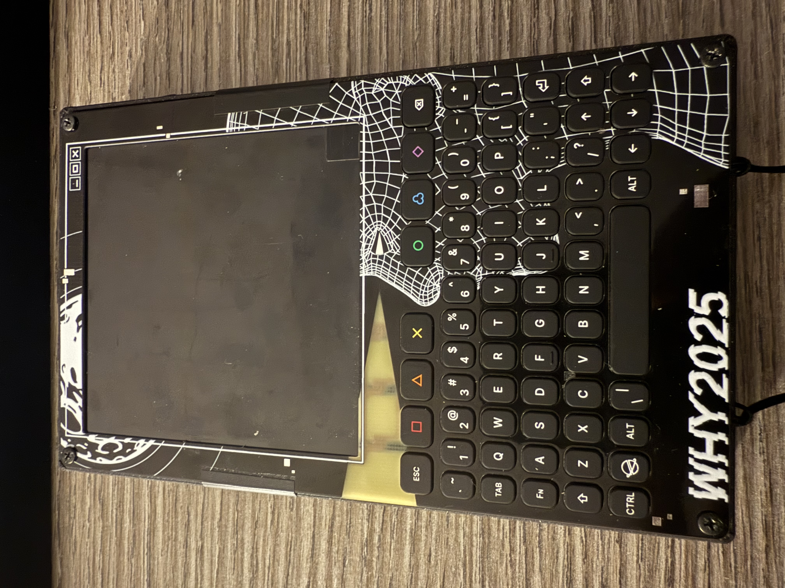

## WHY2025 Badge

> [!WARNING]
> This is an early development port, that just doesn't work

- Status: development
- Ref:

## Hardware
- Module: ESP32-P4
- Display: ST7703 720*720 MIPI-DSI
- Carrier Board: ESP32-C6 (Wi-Fi + Bluetooth)
- Keyboard: QWERTY Keyboard connected via TCA8418

## Images
